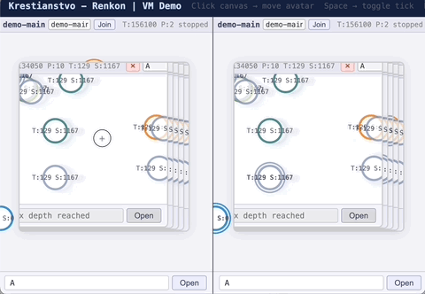

# Krestianstvo - Renkon | Pure FRP Croquet VM 

Introducing the Croquet-TeaTime-inspired, Renkon-driven collaborative computational engine (**WIP**)

#### Live demo (https://renkon.krestianstvo.org)


* Overall all parts of the classic **Croquet VM** are implemented, including **Reflector server**, **Virtual Time**, **Recursive Future Messages**, **Portals** etc. all in Renkon FRP architecture.
* Internal dispatcher of messages queue of the VM is implemented with **recursive causality drain**, that properly handles nested message future sends.
* Portals, Recursive spawning and Parallelising **"sheaf of sheaves of VMs"** running in form of Renkon signals
* No dependencies - works directly in browser or NodeJS
* Snapshot/Restoring logic - late joiners get full state + history replay

### Source files
* [krestianstvo-vm.js](public/krestianstvo-vm.js)
* [reflector.js](reflector.js)




## To run localy

``` 
npm install
npm start
```

Open web browser:   
http://localhost:3000 - for running tests.    
http://localhost:3000/demo.html - for demo app.  


Learn more about:  

* [**Krestianstvo SDK 4**](https://github.com/NikolaySuslov/krestianstvo-playground) - [https://play.krestianstvo.org](https://play.krestianstvo.org)
* [**Croquet VM**](https://github.com/croquet/croquet) 
* [**Renkon**](https://github.com/yoshikiohshima/renkon)

